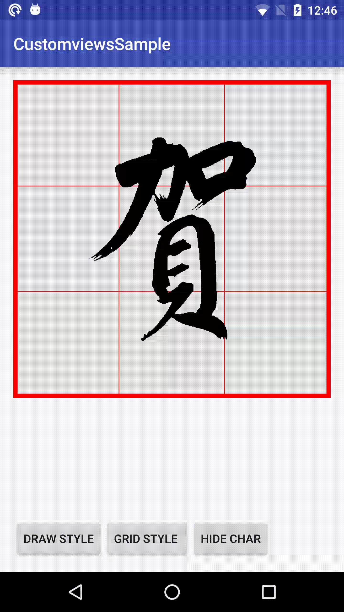

## CalliImageView

## Brief
A custom view for android platform to display Chinese calligraphy
characters with extra features.

## Features
1. fill type vs. contour type
characters with contour lines are more suitable for practicing
hand writings directly on screen.

2. grip type: 9 grids vs diagonal grid
Different grid styles are provided.

3. show/hide character
without character, you can practice writing directly on grid

## Demo


## How to use the library

in build.gradle, include jcenter()
```gradle
buildscript {
    repositories {
        jcenter()
    }
}
```

add following dependency
```gradle
dependencies {
    ...
    compile 'info.plateaukao.android:customviews:1.0.0'
    ...
}
```
